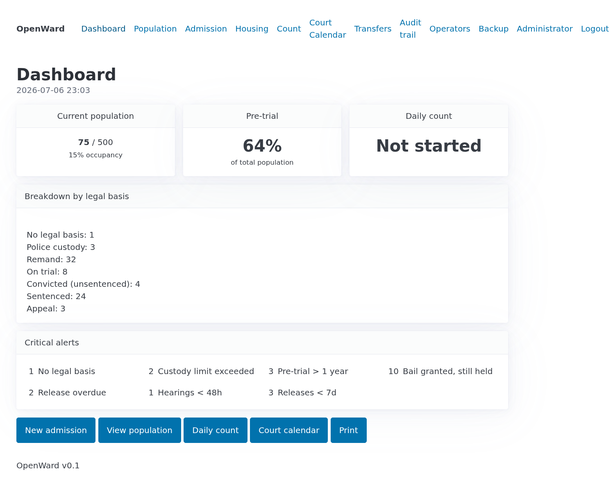
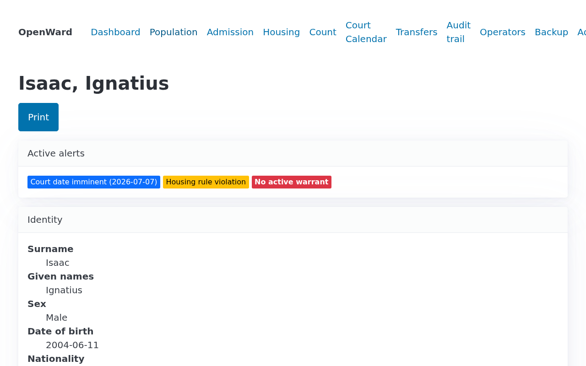
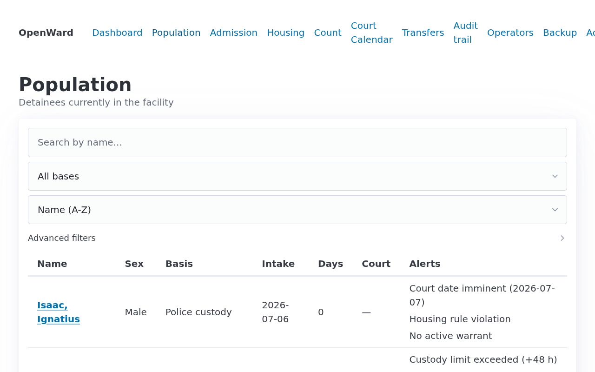
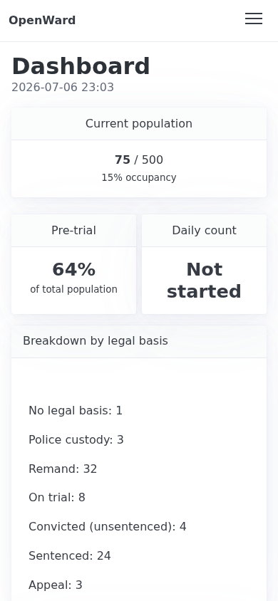

# OpenWard

**A facility records system for correctional institutions in low-resource environments.**

Live demo: **[openward-demo.maxisaacs.com](https://openward-demo.maxisaacs.com)** — seeded with synthetic data.

OpenWard manages the detainee lifecycle — admission, detention basis, court dates, warrants, housing, property, release — for small prisons that today run on paper ledgers. It is designed for the operating reality of facilities in places like Madagascar and the Eastern Caribbean: a Raspberry Pi in a back office, intermittent power, no IT staff, operators with limited technical literacy, and legal-compliance requirements (custody time limits, juvenile separation, audit accountability) that paper systems routinely fail.

<table>
  <tr>
    <td></td>
    <td></td>
  </tr>
  <tr>
    <td></td>
    <td></td>
  </tr>
</table>

## Design decisions

Every architectural choice follows from the deployment environment:

- **Server-rendered HTML + HTMX, no SPA.** Target hardware is a Pi 4 serving a handful of LAN clients over unreliable networks. Full-page renders are fast, partial updates go through HTMX, and there is no JavaScript build pipeline to maintain. The UI works on the Android tablets officers carry on rounds.
- **SQLite, not Postgres.** Single facility, low write volume, one box. SQLite in WAL mode is the correct database, and it makes backup a file-copy problem — which matters when the backup medium is a USB stick a senior officer takes home weekly.
- **Hash-chained audit trail.** Every mutation writes an audit entry carrying a SHA-256 self-hash and a chain hash over the preceding entry. Tampering with historical records — the failure mode that matters most in a custody context — is detectable, and the chain can be re-verified from the UI (`/audit/verify`).
- **Clock-sanity handling.** A Pi has no RTC; after a power cut without NTP the clock is wrong. Date validation detects an insane system clock and degrades rather than blocking intake.
- **Compliance flags computed, not stored.** Custody-time-limit breaches, missing court dates, juvenile housing violations, and expired warrants are derived from the domain model on read, so they can never go stale.
- **i18n from the start.** Fluent-based localization (English, French, Malagasy) plus pluggable legal presets — charge terminology and detention bases are configuration (`legal-presets/*.toml`), not code, because criminal codes differ by jurisdiction.
- **A Pi with systemd is the deployment unit.** No containers, no orchestration. `deploy/` contains the systemd unit, Caddyfile, and a runbook that has been exercised end-to-end.

## Architecture

```
Browser (HTMX)
    ↕  HTTP — server-rendered HTML + JSON API
openward-server        Axum: routes, auth/RBAC, sessions, Askama templates, i18n
    ↕  Arc<AppState>
openward-facility      ServerConfig, AppState, init
    ↕
openward-registry      Registry trait impl, flag computation, audit chain
    ↕
openward-db            SQLite pool, migrations, WAL
```

Cargo workspace, ten crates. `openward-core` holds the domain types and business logic with no async and no database dependency, so the rules (release eligibility, custody-limit math, housing constraints) are plainly testable. `openward-medical`, `openward-visitors`, `openward-disciplinary`, and `openward-commissary` are intentional stubs — module boundaries reserved for the features a real deployment would ask for next.

**Stack:** Rust, Axum, SQLx/SQLite, Askama, HTMX, Pico CSS, Fluent. ~18k lines, 150 tests (integration, auth, RBAC, lifecycle, migrations, i18n).

## Features

- Admission (single and batch), detainee search and population filters
- Detention basis and custody time-limit tracking with computed compliance flags
- Court calendar: scheduling, outcomes, warrant registration
- Housing assignment with capacity and juvenile-separation warnings
- Property log, notes, transfers, release workflow with eligibility checks
- Daily count sheet and facility dashboard
- Operator accounts with role-based access control (admin / supervisor / clerk)
- Tamper-evident audit trail with per-entry detail view and chain verification
- Online backup + CSV export
- Localized UI (en / fr / mg) and per-jurisdiction legal presets

## Running it

```bash
cargo run -p openward-server                # first run creates the DB and an admin account
cargo run -p openward-seed -- --db openward.db --count 80   # optional demo data
```

Configuration is environment-driven (`OPENWARD_DB`, `OPENWARD_BIND`, …); see `deploy/README.md` for the full production runbook (Ubuntu VM or Raspberry Pi, systemd + Caddy with TLS).

## Status

Working demo; not in production use. Single-facility scope. The registry, court, housing, audit, and auth subsystems are complete and tested; medical, visitors, disciplinary, and commissary modules are stubs. [`docs/ROADMAP.md`](docs/ROADMAP.md) is an honest gap analysis of what separates this demo from a system fit to hold real custody data — security hardening, data-protection paperwork, and the operational work (hardware spec, training, tested restores) that matters more than code.

## License

AGPL-3.0-or-later.
